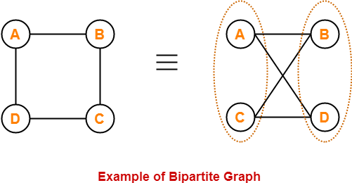

A graph is said to be bipartite if all the vertices of the graph can be represented as 2 different sets (let's say these sets as A and B) such that there is no edge between the vertices of a set.

In other words, the edges in bipartite graph should be from a vertex of set A to another vertex of set B.

### Description

1. We will divide the graph in 2 sets by using the concept of graph coloring.
2. We will mark all the vertices of set A as one color and another color to the vertices of set B.
3. We can use DFS to traverse through the graph. While making DFS call to the adjacent vertex, we will mark the adjacent vertex as the inverted color of the current vertex.
4. If we found that the current vertex is having same color as the adjacent color, this means that both the vertices belongs to the same set and the graph is not bipartite.

### Note

1. It is possible to color a cycle graph with **even** cycle using two colors.
2. It is not possible to color a cycle graph with an **odd** cycle using two colors.

### Example



### Implementation

C++

```cpp
#include <bits/stdc++.h>

using namespace std;

const int maxN = 1000001;

vector<int> G[maxN];

// Stores the color of a node
int color[maxN];

bool dfs(int u) {

	// Exploring the adjacents of current node
	for (int node : G[u]) {
		// Checking if the adjacent node is colored or not
		if (color[node] == 0) {

			// Mark the adjacent node as inverted color of current node
			color[node] = color[u] ^ 1;

			// Apply DFS for adjacent nodes
			if (!dfs(node))
				return false;
		}
		else if (color[node] == color[u]) {
			// If the color of current node and adjacent node is same
			// Then they belong to same set, hence the graph is not bipartite
			return false;
		}
	}


	return true;
}

int main() {
	int vertices, edges;
	cin >> vertices >> edges;

	for (int i = 0; i < edges; i++) {
		int a, b;
		cin >> a >> b;

		// Since it is an undirected graph, so we will update adjacency list of both nodes
		G[a].push_back(b);
		G[b].push_back(a);
	}

	// Start making DFS call from 1st node in the graph
	// A flag to store whether the graph is bipartite
	bool isBipartite = dfs(1);

	cout << "The vertices of set 1: ";
	for (int i = 1; i <= vertices; i++) {
		if (color[i] == 0)
			cout << i << " ";
	}
	cout << endl;

	cout << "The vertices of set 2: ";
	for (int i = 1; i <= vertices; i++) {
		if (color[i] == 1)
			cout << i << " ";
	}
	cout << endl;

	if (isBipartite) {
		cout << "The graph is bipartite" << endl;
	}
	else {
		cout << "The graph is not bipartite" << endl;
	}

	return 0;
}
```

- - -

Java

```java
import java.util.*;

public class BipartiteGraph {

	static class Vertex {
		public int id;
		public List<Vertex> edges;

		public Vertex(int id) {
			this.id = id;
		}
	}

	public static boolean dfs(int node, int[] color, Vertex[] graph) {

		// Exploring the adjacents of current node
		for (Vertex child : graph[node].edges) {
			// Checking if the adjacent node is colored or not
			if (color[child.id] == 0) {

				// Mark the adjacent node as inverted color of current node
				color[child.id] = color[node] ^ 1;

				// Apply DFS for adjacent nodes
				if (!dfs(child.id, color, graph))
					return false;

			} else if (color[node] == color[child.id]) {
				// If the color of current node and adjacent node is same
				// Then they belong to same set, hence the graph is not bipartite
				return false;
			}
		}

		return true;
	}

	public static void main(String[] args) {
		Scanner sc = new Scanner(System.in);

		int vertices = sc.nextInt();
		int edges = sc.nextInt();

		Vertex[] graph = new Vertex[vertices + 1];

		// Stores the color of a node
		int[] color = new int[vertices + 1];

		for (int i = 1; i <= vertices; i++) {
			graph[i] = new Vertex(i);
			graph[i].edges = new ArrayList<Vertex>();
		}

		Vertex v1, v2;

		for (int i = 1; i <= edges; i++) {
			int a = sc.nextInt();
			int b = sc.nextInt();

			v1 = new Vertex(a);
			v2 = new Vertex(b);

			// Since it is an undirected graph, so we will update adjacency list of both nodes
			graph[a].edges.add(v2);
			graph[b].edges.add(v1);
		}

		// Start making DFS call from 1st node in the graph
		// A flag to store whether the graph is bipartite
		boolean isBipartite = dfs(1, color, graph);

		// Print the components which are connected from current node
		System.out.print("The vertices of set 1: ");
		for (int i = 1; i <= vertices; i++) {
			if (color[i] == 0)
				System.out.print(i + " ");
		}
		System.out.println();

		System.out.print("The vertices of set 2: ");
		for (int i = 1; i <= vertices; i++) {
			if (color[i] == 1)
				System.out.print(i + " ");
		}
		System.out.println();

		if (isBipartite) {
			System.out.println("The graph is bipartite");
		} else {
			System.out.println("The graph is not bipartite");
		}

		sc.close();
	}
}
```

- - -

Python

```python
maxN = 1000001

G = {}

# Stores the color of a node
color = [0] * maxN

# Initializing the adjacency list
for i in range(maxN):
    G[i] = list()

def dfs(u):
    # Exploring the adjacents of current node
    for node in G[u]:
        # Checking if the adjacent node is colored or not
        if color[node] == 0:
            # Mark the adjacent node as inverted color of current node
            color[node] = color[u] ^ 1
            
            # Apply DFS for adjacent nodes
            if dfs(node) is False:
                return False

        elif color[node] == color[u]:
            # If the color of current node and adjacent node is same
            # Then they belong to same set, hence the graph is not bipartite
            return False

    return True


vertices, edges = map(int, input().split())

for i in range(edges):
    a, b = map(int, input().split())

    # Since it is an undirected graph, so we will update adjacency list of both nodes
    G[a].append(b)
    G[b].append(a)

# A flag to store whether the graph is bipartite
isBipartite = dfs(1)

print("The vertices of set 1:", end=' ')
for i in range(1, vertices + 1):
    if color[i] == 0:
        print(i, end=' ')
print()

print("The vertices of set 2:", end=' ')
for i in range(1, vertices + 1):
    if color[i] == 1:
        print(i, end=' ')
print()

if isBipartite:
    print("The graph is bipartite")
else:
    print("The graph is not bipartite")
```

- - -

### Practice Problems

1. [BUGLIFE - SPOJ](https://www.spoj.com/problems/BUGLIFE/)