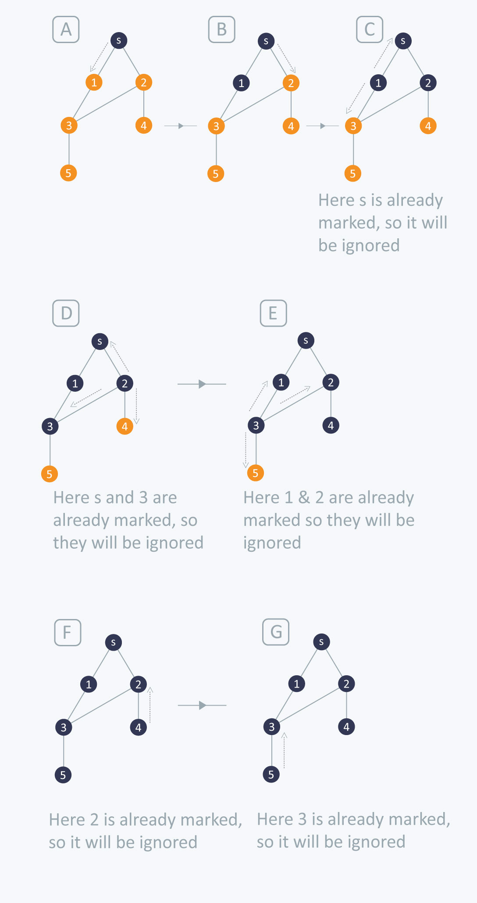

### Introduction

1. Breadth first search is one of the basic and essential searching algorithms on graphs.
2. The path found by breadth first search to any node is the shortest path to that node, i.e the path that contains the smallest number of edges in unweighted graphs.

### Description

1. The algorithm works by maintaining a Queue of adjacent vertices.
2. First, we mark the source vertex $S$ as visited.
3. Then, we explore all the adjacent of $S$.
4. If the adjacent vertex is not visited then we mark it as visited.
5. The algorithm works until the queue is empty.

### Example



### Implementation

```cpp
#include <bits/stdc++.h>

using namespace std;
	
const int maxN = 1000001;

vector<int> G[maxN];
bool visited[maxN];

void bfs(int u) {

	queue<int> Q;
	visited[u] = true;
	Q.push(u);

	while(!Q.empty()) {

		int curr = Q.front();
		Q.pop();

		cout << curr << " ";

		for (int neighbour: G[curr]) {
			if (!visited[neighbour]) {
				visited[neighbour] = true;
				Q.push(neighbour);
			}
		}
	}
}

int main() {
	int vertices, edges;
	cin >> vertices >> edges;

	
	for (int i = 0; i < edges; i++) {
		int a, b;
		cin >> a >> b;

		// Since it is an undirected graph, so we will update adjacency list of both nodes
		G[a].push_back(b);
		G[b].push_back(a);
			
	}

	cout << "BFS Traversal: ";
	bfs(1); // We will start the traversal from 1st node since the graph is 1-based
	cout << endl;
	return 0;
}
```

### Time Complexity: $O(V+E)$

### Space Complexity: $O(V)$

### Practice Problems:

1. [AKBAR - SPOJ](https://www.spoj.com/problems/AKBAR/)
2. [Shortest Path - Codeforces](http://codeforces.com/contest/59/problem/E)
3. [Prime Path - SPOJ](https://www.spoj.com/problems/PPATH/en/)