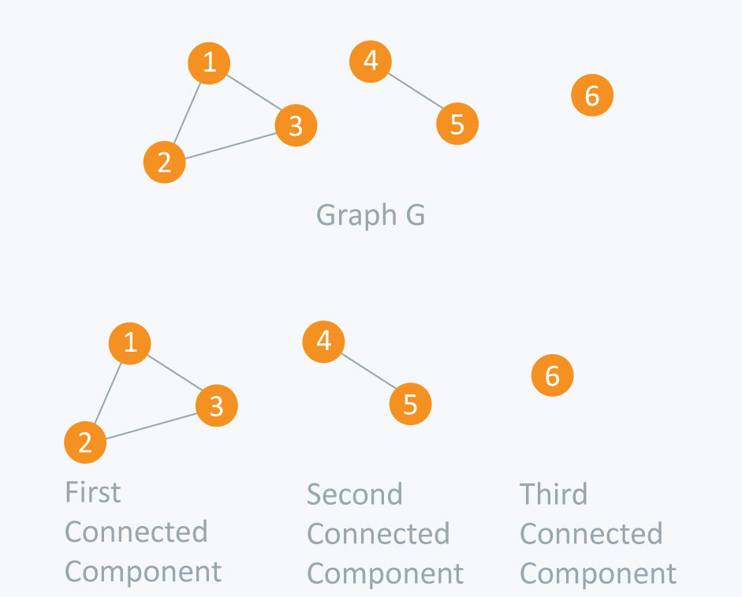

Given an undirected graph G with n nodes and m edges. We are required to find in it all the connected components, i.e, several groups of vertices such that within a group each vertex can be reached from another and no path exists between different groups.

### Description
1. We will be doing a series of rounds of DFS: The first round will start from first node and all the nodes in the first connected component will be traversed (found). 
2. Then we find the first unvisited node of the remaining nodes, and run Depth First Search on it, thus finding a second connected component. And so on, until all the nodes are visited.
3. The total asymptotic running time of this algorithm is $O(n+m)$.
5. In fact, this algorithm will not run on the same vertex twice, which means that each edge will be seen exactly two times (at one end and at the other end).

### Example



### Implementation

C++ 

```cpp
#include <bits/stdc++.h>

using namespace std;

const int maxN = 1000001;

vector<int> G[maxN];
bool visited[maxN];

vector<int> connected; // Holds the components which are connected

void dfs(int u) {
	visited[u] = true;

	connected.push_back(u); // Push current node because there exists an edge from previous node

	for (int node : G[u])
		if (!visited[node])
			dfs(node);
}

int main() {
	int vertices, edges;
	cin >> vertices >> edges;

	for (int i = 0; i < edges; i++) {
		int a, b;
		cin >> a >> b;

		// Since it is an undirected graph, so we will update adjacency list of both nodes
		G[a].push_back(b);
		G[b].push_back(a);
	}

	int connectedComponents = 0; // Total number of connected components

	for (int i = 1; i <= vertices; ++i)
	{
		if (!visited[i]) {
			// Clears the components for next iteration
			connected.clear();

			// Make a DFS call to the unvisited node
			dfs(i);

			// Increment the number of total connected components
			connectedComponents++;

			// Print the components which are connected from current node
			cout << "Components which are connected: ";
			for (int a : connected)
				cout << a << " ";
			cout << endl;
		}
	}

	cout << "Total Connected Components in the graph are: " << connectedComponents << endl;
	return 0;
}
```
---
Java
```java
import java.util.*;

public class ConnectedComponents {

	static class Vertex {
		public int id;
		public List<Vertex> edges;

		public Vertex(int id) {
			this.id = id;
		}
	}

	public static void dfs(int node, boolean[] visited, Vertex[] graph, List<Vertex> components) {

		visited[node] = true;

		// Push current node because there exists an edge from previous node
		components.add(new Vertex(node));

		for (Vertex child : graph[node].edges) {
			if (!visited[child.id])
				dfs(child.id, visited, graph, components);
		}
	}

	public static void main(String[] args) {
		Scanner sc = new Scanner(System.in);

		int vertices = sc.nextInt();
		int edges = sc.nextInt();

		Vertex[] graph = new Vertex[vertices + 1];
		boolean[] visited = new boolean[vertices + 1];

		for (int i = 1; i <= vertices; i++) {
			graph[i] = new Vertex(i);
			graph[i].edges = new ArrayList<Vertex>();
		}

		Vertex v1, v2;

		for (int i = 1; i <= edges; i++) {
			int a = sc.nextInt();
			int b = sc.nextInt();

			v1 = new Vertex(a);
			v2 = new Vertex(b);

			// Since it is an undirected graph, so we will update adjacency list of both nodes
			graph[a].edges.add(v2);
			graph[b].edges.add(v1);
		}

		int connectedComponents = 0;

		// Holds the components which are connected
		List<Vertex> components = new ArrayList<Vertex>();

		for (int i = 1; i <= vertices; i++) {
			if (!visited[i]) {
				// Clears the components for next iteration
				components.clear();

				// Make a DFS call to the unvisited node
				dfs(i, visited, graph, components);

				// Increment the number of total connected components
				connectedComponents++;

				// Print the components which are connected from current node
				System.out.print("Components which are connected: ");
				for (Vertex v : components) {
					System.out.print(v.id + " ");
				}
				System.out.println();
			}
		}

		System.out.println("Total Connected Components in the graph are: " + connectedComponents);

		sc.close();
	}
}

// Time complexity: O(V + E), where V is the number of vertices and E is the number of edges in the graph.
// Space Complexity: O(V). Since, an extra visited array is needed of size V.
```

---
Python

```python
maxN = 1000001

G = {}
visited = [False] * maxN
connected = [] # Holds the components which are connected

# Initializing the adjacency list
for i in range(maxN):
    G[i] = list()

def dfs(u):
    visited[u] = True

    # Push current node because there exists an edge from previous node
    connected.append(u)
    
    for node in G[u]:
        if visited[node] is False:
            dfs(node)

vertices, edges = map(int, input().split())

for i in range(edges):
    a, b = map(int, input().split())

    # Since it is an undirected graph, so we will update adjacency list of both nodes
    G[a].append(b)
    G[b].append(a)

# Total number of connected components
connectedComponents = 0

for i in range(1, vertices + 1):
    if visited[i] is False:
        
        # Clears the components for next iteration
        connected = []
        
        # Make a DFS call to the unvisited node
        dfs(i)

        # Increment the number of total connected components
        connectedComponents += 1

        # Print the components which are connected from current node
        print("Components which are connected:", end=' ')
        for v in connected:
            print(v, end=' ')
        print()

print(f"Total Connected Components in the graph are: {connectedComponents}")
```

- - -

### Practice Problems

1. [Connected Components - HackerEarth](https://www.hackerearth.com/problem/algorithm/connected-components-in-a-graph/description/)
2. [Is it a Tree? - SPOJ](https://www.spoj.com/problems/PT07Z/en/)
3. [Fire Escape Routes - CodeChef](https://www.codechef.com/problems/FIRESC)
4. [Connected Components? - Codeforces](https://codeforces.com/problemset/problem/920/E)
5. [Love Polygon - CodeChef](https://www.codechef.com/problems/LVPOL)