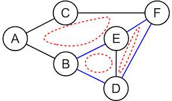

A undirected graph is said to be cyclic if there exists atleast one cycle among the vertices in the graph.

### Description

1. There is a cycle in a graph only if there is a back edge present in the graph.
2. A back edge is an edge that is joining a node to itself (self-loop) or one of its parent in the graph produced by DFS.
3. To find the back edge to any of its parent, keep a visited array and if there is a back edge to any visited node then there is a loop and the graph is a cyclic graph.

### Example



### Implementation

C++

```cpp
#include <bits/stdc++.h>

using namespace std;

const int maxN = 1000001;

vector<int> G[maxN];
bool visited[maxN];


bool dfs(int u, int parent = -1) {

	// Mark the current node as visited
	visited[u] = true;

	// Explore all the vertices adjacent to this vertex
	for (int node : G[u]) {

		// If an adjacent is not visited, then recur for that adjacent
		if (!visited[node]) {

			// Check if there is cycle by calling adjacent node as current node
			// And current node as the parent node
			if (dfs(node, u))
				return true;
		}
		else if (node != parent) {
			// If an adjacent is visited and not parent of current vertex,
			// then there is a cycle.
			return true;
		}
	}

	return false;
}

int main() {
	int vertices, edges;
	cin >> vertices >> edges;

	for (int i = 0; i < edges; i++) {
		int a, b;
		cin >> a >> b;

		// Since it is an undirected graph, so we will update adjacency list of both nodes
		G[a].push_back(b);
		G[b].push_back(a);
	}

	// Start making DFS call from 1st node in the graph
	bool isCycle = dfs(1);

	if (isCycle) {
		cout << "Cycle is present in the graph" << endl;
	} else {
		cout << "No cycle is present in the graph" << endl;
	}

	return 0;
}
```

- - -

Java

```java
import java.util.*;

public class Cycle {

	static class Vertex {
		public int id;
		public List<Vertex> edges;

		public Vertex(int id) {
			this.id = id;
		}
	}

	public static boolean dfs(int node, boolean[] visited, Vertex[] graph, int parent) {

		// Mark the current node as visited
		visited[node] = true;

		// Explore all the vertices adjacent to this vertex
		for (Vertex child : graph[node].edges) {

			// If an adjacent is not visited, then recur for that adjacent
			if (!visited[child.id]) {

				// Check if there is cycle by calling adjacent node as current node
				// And current node as the parent node
				if (dfs(child.id, visited, graph, node))
					return true;

			} else if (child.id != parent) {
				// If an adjacent is visited and not parent of current vertex,
				// then there is a cycle.
				return true;
			}
		}

		return false;
	}

	public static void main(String[] args) {
		Scanner sc = new Scanner(System.in);

		int vertices = sc.nextInt();
		int edges = sc.nextInt();

		Vertex[] graph = new Vertex[vertices + 1];
		boolean[] visited = new boolean[vertices + 1];

		for (int i = 1; i <= vertices; i++) {
			graph[i] = new Vertex(i);
			graph[i].edges = new ArrayList<Vertex>();
		}

		Vertex v1, v2;

		for (int i = 1; i <= edges; i++) {
			int a = sc.nextInt();
			int b = sc.nextInt();

			v1 = new Vertex(a);
			v2 = new Vertex(b);

			// Since it is an undirected graph, so we will update adjacency list of both nodes
			graph[a].edges.add(v2);
			graph[b].edges.add(v1);
		}


		int parent = -1;

		// Start making DFS call from 1st node in the graph
		boolean isCyclic = dfs(1, visited, graph, parent);

		if (isCyclic) {
			System.out.println("Cycle is present in the graph");
		} else {
			System.out.println("No cycle is present in the graph");
		}

		sc.close();
	}
}
```

- - -

Python

```python
maxN = 1000001

G = {}
visited = [False] * maxN

# Initializing the adjacency list
for i in range(maxN):
    G[i] = list()

def dfs(u, parent = -1):

    # Mark the current node as visited
    visited[u] = True
    
    # Explore all the vertices adjacent to this vertex
    for node in G[u]:

        # If an adjacent is not visited, then recur for that adjacent
        if visited[node] is False:

            # Check if there is cycle by calling adjacent node as current node
            # And current node as the parent node
            if dfs(node, u):
                return True
        
        elif node != parent:
            # If an adjacent is visited and not parent of current vertex,
            # then there is a cycle.
            return True

    return False

vertices, edges = map(int, input().split())

for i in range(edges):
    a, b = map(int, input().split())

    # Since it is an undirected graph, so we will update adjacency list of both nodes
    G[a].append(b)
    G[b].append(a)

# Start making DFS call from 1st node in the graph
isCycle = dfs(1)

if isCycle:
    print("Cycle is present in the graph")
else:
    print("No cycle is present in the graph")
```

- - -

#### Time Complexity - $O(V+E)$

A simple DFS Traversal of the graph which is represented using adjacency list. So the time complexity is $O(V+E)$ where $V$ are the number of vertices and $E$ are the number of edges in the graph.

#### Space Complexity - $O(V)$

To store the visited array, $O(V)$ space is required.