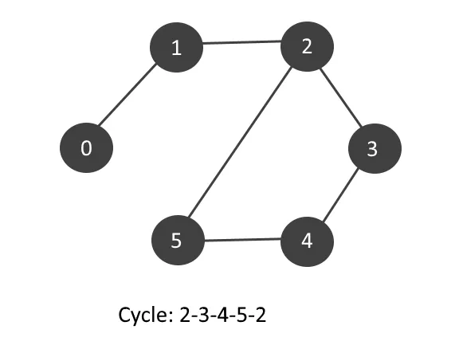

A undirected graph is said to be cyclic if there exists atleast one cycle among the vertices in the graph. If cycles are found, print all the cycles.

### Description

1. We will use the concept of **Graph Coloring** and color all the vertices which occur in a cyclic graph.
2. We will run a series of DFS in the graph. 
3. Initially all vertices are colored **WHITE** (i.e white color can be represented by 0). 
4. From each unvisited **white** vertex, start the DFS, mark it **GRAY** (i.e gray color can be represented by 1) while entering and mark it **BLACK** (i.e black color can be represented by 2) on exit. 
5. If DFS moves to a **gray** vertex, then we have found a cycle. 
6. If a partially visited vertex (**gray** colored vertex) is found, backtrack till the vertex is
   reached again and mark all vertices in the path with a counter which is cycle number.
7. After completion of DFS, we will iterate for cyclic edge and push them
   into a separate adjacency list.
8. Print all the cycles number wise from the adjacency list.

### Example



### Implementation

C++

```cpp
#include <bits/stdc++.h>

using namespace std;

const int maxN = 1000001;

vector<int> G[maxN];

// Stores the processing status of a vertex
int color[maxN];

// Stores the parent of a vertex
int parent[maxN];

// Stores the visited status of a vertex
int visited[maxN];

// Total number of cycles in the graph
int cycleNumber = 0;

void dfs(int u, int par = 0) {

	// Idea is to mark a vertex by processing status
	// 1. color = 0 -> If the vertex is not visited (white)
	// 2. color = 1 -> To visit a vertex partially (gray)
	// 3. color = 2 -> To visit a vertex completely (black)

	// Already visited vertex.
	if (color[u] == 2)
		return;

	// Cycle detected when a vertex is visited partially
	if (color[u] == 1) {
		cycleNumber++;

		// Backtracking based on parents to find the complete cycle
		int current = par;
		visited[current] = cycleNumber;
		while (current != u) {
			current = parent[current];
			visited[current] = cycleNumber;
		}
		return;
	}

	// Marking the parent of a vertex
	parent[u] = par;

	// Marking the node as partially visited
	color[u] = 1;

	// Running DFS on graph
	for (int node : G[u]) {

		// If the vertex is previously visited
		if (node == parent[u])
			continue;

		// If the vertex is not visited
		dfs(node, u);
	}

	// Marking the vertex as completely visited
	color[u] = 2;
}

int main() {
	int vertices, edges;
	cin >> vertices >> edges;

	for (int i = 0; i < edges; i++) {
		int a, b;
		cin >> a >> b;

		// Since it is an undirected graph, so we will update adjacency list of both nodes
		G[a].push_back(b);
		G[b].push_back(a);
	}

	// Traversing from first node
	dfs(1);

	// Adjacency list to store the cycles
	map<int, vector<int>> cycles;

	for (int i = 1; i <= vertices; ++i)
	{
		if (visited[i] != 0) {
			cycles[visited[i]].push_back(i);
		}
	}

	// Printing the cycle
	for (auto cycle : cycles) {
		cout << "Cycle Number " << cycle.first << ": ";
		for (int x : cycle.second)
			cout << x << " ";
		cout << endl;
	}

	return 0;
}
```

- - -

Java

```java
import java.util.*;

public class PrintCycle {

	// Total number of cycles in the graph
	public static int cycleNumber = 0;

	static class Vertex {
		public int id;
		public List<Vertex> edges;

		public Vertex(int id) {
			this.id = id;
		}
	}

	public static void dfs(int node, int[] visited, int[] color, Vertex[] graph, int[] parent, int par) {

		// Idea is to mark a vertex by processing status
		// 1. color = 0 -> If the vertex is not visited (white)
		// 2. color = 1 -> To visit a vertex partially (gray)
		// 3. color = 2 -> To visit a vertex completely (black)

		// Already visited vertex.
		if (color[node] == 2)
			return;

		// Cycle detected when a vertex is visited partially
		if (color[node] == 1) {
			cycleNumber++;

			// Backtracking based on parents to find the complete cycle
			int current = par;
			visited[current] = cycleNumber;
			while (current != node) {
				current = parent[current];
				visited[current] = cycleNumber;
			}
			return;
		}


		// Marking the parent of a vertex
		parent[node] = par;

		// Marking the node as partially visited
		color[node] = 1;

		// Running DFS on graph
		for (Vertex child : graph[node].edges) {

			// If the vertex is previously visited
			if (child.id == parent[node])
				continue;

			// If the vertex is not visited
			dfs(child.id, visited, color, graph, parent, node);
		}

		// Marking the vertex as completely visited
		color[node] = 2;
	}

	public static void main(String[] args) {
		Scanner sc = new Scanner(System.in);

		int vertices = sc.nextInt();
		int edges = sc.nextInt();

		Vertex[] graph = new Vertex[vertices + 1];

		// Stores the visited status of a vertex
		int[] visited = new int[vertices + 1];

		// Stores the processing status of a vertex
		int[] color = new int[vertices + 1];

		// Stores the parent of a vertex
		int[] parent = new int[vertices + 1];

		for (int i = 1; i <= vertices; i++) {
			graph[i] = new Vertex(i);
			graph[i].edges = new ArrayList<Vertex>();
		}

		Vertex v1, v2;

		for (int i = 1; i <= edges; i++) {
			int a = sc.nextInt();
			int b = sc.nextInt();

			v1 = new Vertex(a);
			v2 = new Vertex(b);

			// Since it is an undirected graph, so we will update adjacency list of both nodes
			graph[a].edges.add(v2);
			graph[b].edges.add(v1);
		}


		int par = 0;

		// Start making DFS call from 1st node in the graph
		dfs(1, visited, color, graph, parent, par);

		// Adjacency list to store the cycles
		Map<Integer, ArrayList<Integer>> cycles = new HashMap<>();
		for (int i = 1; i <= vertices; ++i) {
			if (visited[i] != 0) {
				cycles.computeIfAbsent(visited[i], k -> new ArrayList<>()).add(i);
			}
		}

		// Printing the cycle
		for (Map.Entry<Integer, ArrayList<Integer>> entry : cycles.entrySet()) {
			int key = entry.getKey();
			ArrayList<Integer> values = entry.getValue();

			System.out.print("Cycle Number " + key + ": ");
			for (int i : values) {
				System.out.print(i + " ");
			}
			System.out.println();
		}
		sc.close();
	}
}
```

- - -

### Time Complexity - $O(V+E)$

where $V$ is number of vertices and $E$ is the number of edges.

### Space Complexity - $O(V)$

The auxillary space required will be $O(V)$ where $V$ is the number of vertices.

### Practice Problems

1. [Cycles and Colorings - Codechef](https://www.codechef.com/IOITC181/problems/CYCLECOL)