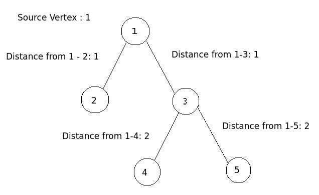

Given an undirected graph, find the distance between source vertex to all the other vertices in the graph.

Distance of a vertex can be defined as the number of edges between the source vertex and the destination vertex.

### Description

1. We will select a source vertex in the graph.
2. We will run a series of DFS in the graph.
3. The distance of the source vertex will be always $0$.
4. We will maintain a distance array which will hold the distance from source vertex to another vertex.
5. After visiting the source vertex, we further perform DFS for each adjacent vertex that we haven’t visited before and update the distance for adjacent vertex to be the distance of source vertex + 1.

### Note

1. This algorithm only works when the given undirected graph is a tree i.e it follows the terminologies of a tree.
2. A graph $G$ can be a tree if and only if it satisfies the following conditions:

   * The number of connected components in $G$ is only $1$.
   * The number of edges in $G$ must be one less than the number of vertices i.e $(|E| = |V| - 1)$.

### Example



### Implementation

C++

```cpp
#include <bits/stdc++.h>

using namespace std;

const int maxN = 1000001;

vector<int> G[maxN];

// Visited array
bool visited[maxN];

// Stores the distances of the vertices
int dist[maxN];

void dfs(int u, int d = 0) {
	// Mark the current node as visited
	visited[u] = true;

	// Update the distance of current node
	dist[u] = d;

	// Explore all the adjacent nodes of current node
	for (int node : G[u])
		// If the adjacent node is not visited
		if (!visited[node])
			// Run DFS on the adjacent node
			// Distance between the current node and adjacent node:
			// Distance[adjacent] = Distance[current] + 1
			// cause there is a edge from current node to adjacent node
			dfs(node, dist[u] + 1);
}

int main() {
	int vertices, edges;
	cin >> vertices >> edges;

	for (int i = 0; i < edges; i++) {
		int a, b;
		cin >> a >> b;

		// Since it is an undirected graph, so we will update adjacency list of both nodes
		G[a].push_back(b);
		G[b].push_back(a);
	}

	// Source vertex
	int start = 1;

	// We will start the traversal from source vertex
	dfs(start);

	// Print all the distance from source vertex to all the vertices
	for (int i = 1; i <= vertices; ++i)
	{
		cout << "Distance from " << start << " to " << i << ": " << dist[i] << endl;
	}

	return 0;
}
```

- - -

Java

```java
import java.util.*;

public class SSSP {

	static class Vertex {
		public int id;
		public List<Vertex> edges;

		public Vertex(int id) {
			this.id = id;
		}
	}

	public static void dfs(int node, boolean[] visited, Vertex[] graph, int[] distance, int currentDistance) {
		// Mark the current node as visited
		visited[node] = true;

		// Update the distance of current node
		distance[node] = currentDistance;

		// Explore all the adjacent nodes of current node
		for (Vertex child : graph[node].edges) {
			// If the adjacent node is not visited
			if (!visited[child.id])
				// Run DFS on the adjacent node
				// Distance between the current node and adjacent node:
				// Distance[adjacent] = Distance[current] + 1
				// cause there is a edge from current node to adjacent node
				dfs(child.id, visited, graph, distance, distance[node] + 1);
		}
	}

	public static void main(String[] args) {
		Scanner sc = new Scanner(System.in);

		int vertices = sc.nextInt();
		int edges = sc.nextInt();

		Vertex[] graph = new Vertex[vertices + 1];

		// Visited array
		boolean[] visited = new boolean[vertices + 1];

		// Stores the distances of the vertices
		int[] distance = new int[vertices + 1];

		for (int i = 1; i <= vertices; i++) {
			graph[i] = new Vertex(i);
			graph[i].edges = new ArrayList<Vertex>();
		}

		Vertex v1, v2;

		for (int i = 1; i <= edges; i++) {
			int a = sc.nextInt();
			int b = sc.nextInt();

			v1 = new Vertex(a);
			v2 = new Vertex(b);

			// Since it is an undirected graph, so we will update adjacency list of both nodes
			graph[a].edges.add(v2);
			graph[b].edges.add(v1);
		}

		// Initial Distance
		int currentDistance = 0;

		// Source vertex
		int start = 1;

		// We will start the traversal from source vertex
		dfs(start, visited, graph, distance, currentDistance);

		// Print all the distance from source vertex to all the vertices
		for (int i = 1; i <= vertices; i++) {
			System.out.println("Distance from " + start + " to " + i + ": " + distance[i]);
		}

		sc.close();
	}
}
```

- - -

Python

```python
maxN = 1000001

G = {}

# Visited array
visited = [False] * maxN

# Stores the distances of the vertices
distance = [0] * maxN

# Initializing the adjacency list
for i in range(maxN):
    G[i] = list()

def dfs(u, d = 0):
    # Mark the current node as visited
    visited[u] = True

    # Update the distance of current node
    distance[u] = d
    
    # Explore all the adjacent nodes of current node
    for node in G[u]:
        # If the adjacent node is not visited
        if visited[node] is False:
            # Run DFS on the adjacent node
            # Distance between the current node and adjacent node:
            # Distance[adjacent] = Distance[current] + 1 
            # cause there is a edge from current node to adjacent node
            dfs(node, distance[u] + 1)

vertices, edges = map(int, input().split())

for i in range(edges):
    a, b = map(int, input().split())

    # Since it is an undirected graph, so we will update adjacency list of both nodes
    G[a].append(b)
    G[b].append(a)

# Source vertex
start = 1

# We will start the traversal from source vertex
dfs(start)

# Print all the distance from source vertex to all the vertices
for i in range(1, vertices + 1):
    print(f"Distance from {start} to {i}: {distance[i]}")
```

- - -

### Time Complexity - $O(V+E)$

A simple DFS Traversal of the graph which is represented using adjacency list. So the time complexity is $O(V+E)$ where $V$ are the number of vertices and $E$ are the number of edges in the graph.

### Space Complexity - $O(V)$

To store the visited and distance array, $O(V)$ space is required.

### Practice Problems

1. [Bishu and his Girlfriend - HackerEarth](https://www.hackerearth.com/practice/algorithms/graphs/depth-first-search/practice-problems/algorithm/bishu-and-his-girlfriend/)