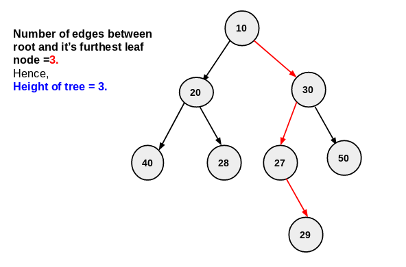

The height or depth of a binary tree is the number of edges between the tree's root and its furthest leaf.

It can be also defined as the number of edges or nodes on longest path from root node to leaf node.

### Approach

1. We will use the **POST-ORDER** traversal on the binary tree.
2. Calculate the height of left and right subtree. 
3. The height of the subtree rooted at any node will be equal to maximum height of its left and right subtree plus one. 
4. We recursively apply this property to all tree nodes in post-order manner and return maximum height of the subtree rooted at that node.

### Example



### Implementation

C++

```cpp
#include <bits/stdc++.h>

using namespace std;

class Node {
public:
	int data;
	Node* left;
	Node* right;
};

Node* newNode(int data) {
	Node* node = new Node();
	node->data = data;
	node->left = NULL;
	node->right = NULL;

	return node;
}

int height(Node* root) {
	if (root == NULL) return 0;

	// Finding the height of left subtree
	int leftTreeHeight = height(root->left);

	// Finding the height of right subtree
	int rightTreeHeight = height(root->right);

	return 1 + max(leftTreeHeight, rightTreeHeight);
}

int main()
{
	Node *root = newNode(1);
	root->left = newNode(2);

	root->right = newNode(3);
	root->right->left = newNode(4);
	root->right->right = newNode(5);
	root->right->left->left = newNode(6);

	// Tree is
	/*
		  1
		/	\
	   2	 3
	   		/  \
	   	   4	5
	   	  /
	   	 6
	*/
	// The height of the above binary tree is 4
	int ans = height(root);
	cout << "Height: " << ans << endl;
	return 0;
}
```

- - -

### Time Complexity - $O(N)$

Where $N$ is the number of nodes in the binary tree.

### Space Complexity - $O(N)$

Where $N$ is the number of nodes in the binary tree.

### Practice Problems

1. [Height of a Binary Tree - HackerRank](https://www.hackerrank.com/challenges/tree-height-of-a-binary-tree/problem)